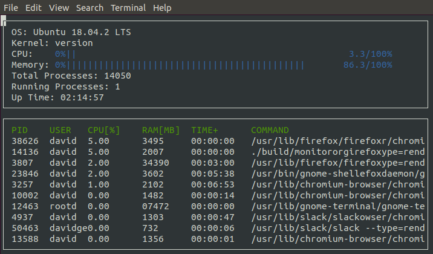

# System_Monitor

## Project Overview
In this project, we will write system monitor application similar to htop in C++.
<p align="center">  </p> 

## Installation

```sh
$ git clone https://github.com/nalbert9/System_Monitor.git
$ sudo apt install libncurses5-dev libncursesw5-dev
```

### Make
This project uses [Make](https://www.gnu.org/software/make/). The Makefile has four targets:
* `build` compiles the source code and generates an executable
* `format` applies [ClangFormat](https://clang.llvm.org/docs/ClangFormat.html) to style the source code
* `debug` compiles the source code and generates an executable, including debugging symbols
* `clean` deletes the `build/` directory, including all of the build artifacts
* `make build` build the project

### Run 
Run the resulting executable: `./build/monitor`
